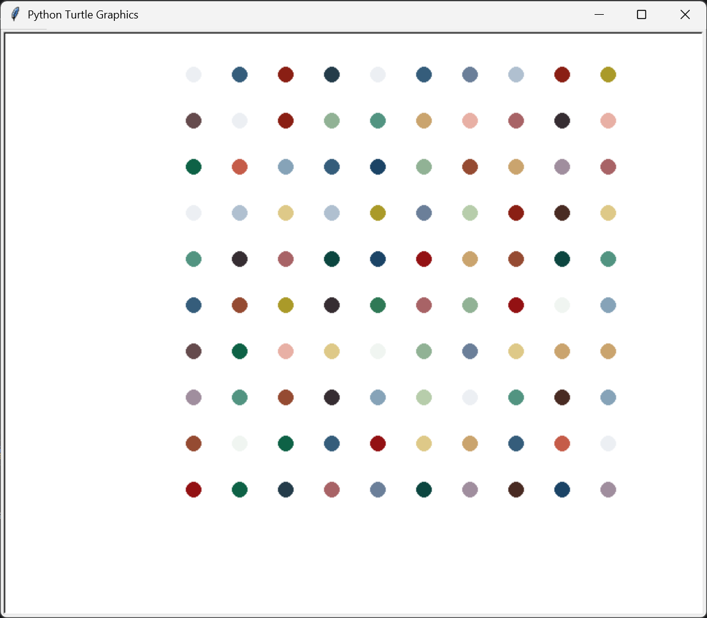

# Hirst Dot Painting

A Python Turtle project that recreates Damien Hirst–style spot paintings using a grid of colored dots.

## Features

- Draws a 10×10 grid of dots
- Uses an RGB color palette extracted from an image
- Random color for each dot
- Fast, clean animation with Turtle

## How to Run

1. Save the file as `hirst_painting.py`.
2. (Optional) Place an image file (e.g., `image.jpg`) in the same folder and uncomment the color extraction code.
3. Run:

```bash
python hirst_painting.py
```

## Output



## Notes

- The color list is pre-extracted from an image using `colorgram`.
- You can change `number_of_dots`, dot size, or spacing to customize the pattern.
